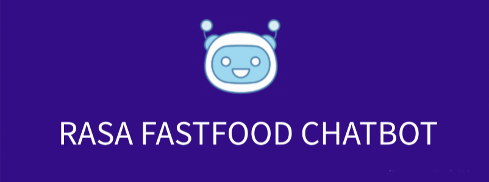
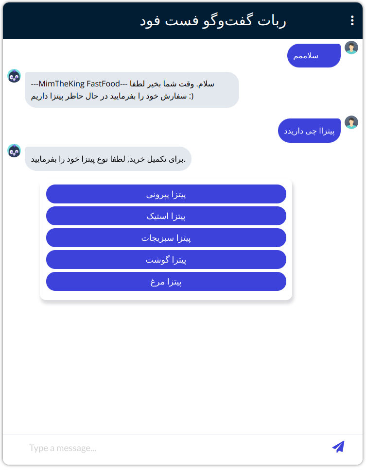
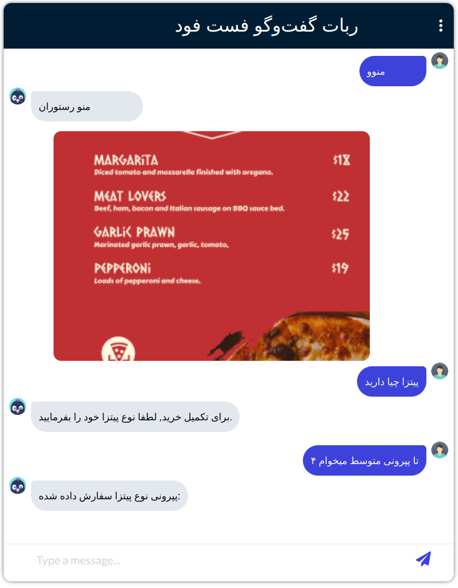
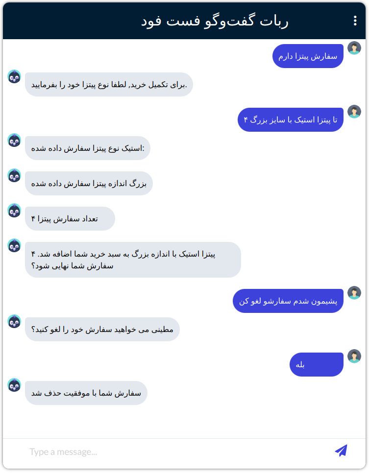
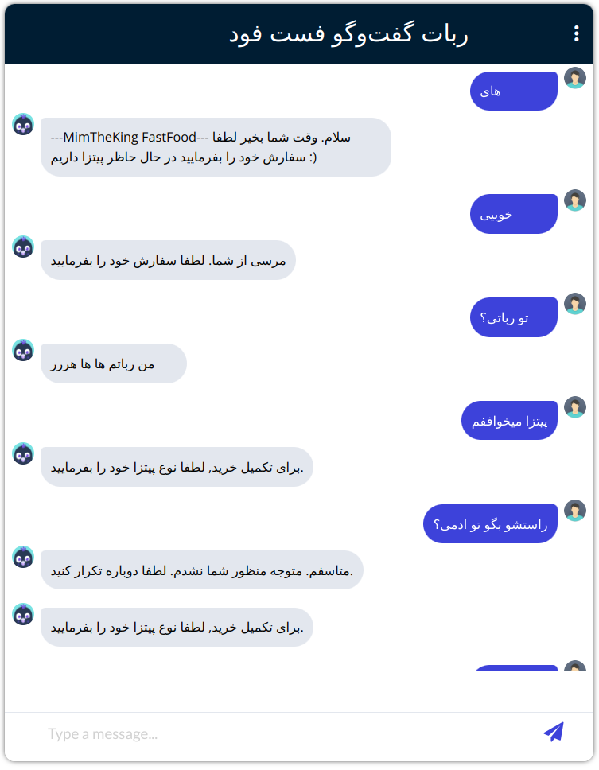

# Fast-Food-Bot
<p align="center"></p>
The Fast-Food-Bot is a conversational AI chatbot built using Rasa for natural language processing and Flask for serving the API. This bot allows users to have a seamless and interactive experience while ordering fast food.

## Features

- Interactive conversation to order fast food items.
- Built with Rasa for advanced natural language understanding.
- Flask API to handle requests and serve the chatbot interface.

## Screenshots

Here are some examples of conversations you can have with this bot:

<p float="left">


</p>
<p float="left">


</p>

## Getting Started

To run this bot, you need to have Docker installed on your machine. Follow the instructions below to get started.

### Prerequisites

- [Docker](https://docs.docker.com/get-docker/) installed on your machine.
- [Docker Compose](https://docs.docker.com/compose/install/) installed on your machine.

### Installation

1. Clone the repository:
    ```sh
    git clone https://github.com/yourusername/fast-food-bot.git
    cd fast-food-bot
    ```

2. Build and run the Docker containers:
    ```sh
    docker-compose up --build -d
    ```

3. Open your browser and go to `http://172.20.0.2:5000/` to chat with the bot.

## Usage

Once the application is up and running, you can interact with the Fast-Food-Bot through the web interface provided at `http://172.20.0.2:5000/`. The bot is designed to handle various types of fast food orders and provide a smooth user experience.

## License

This project is licensed under the MIT License - see the [LICENSE](LICENSE) file for details.

## Acknowledgements

- [Rasa](https://rasa.com/)
- [Flask](https://flask.palletsprojects.com/)


Enjoy your interaction with Fast-Food-Bot!